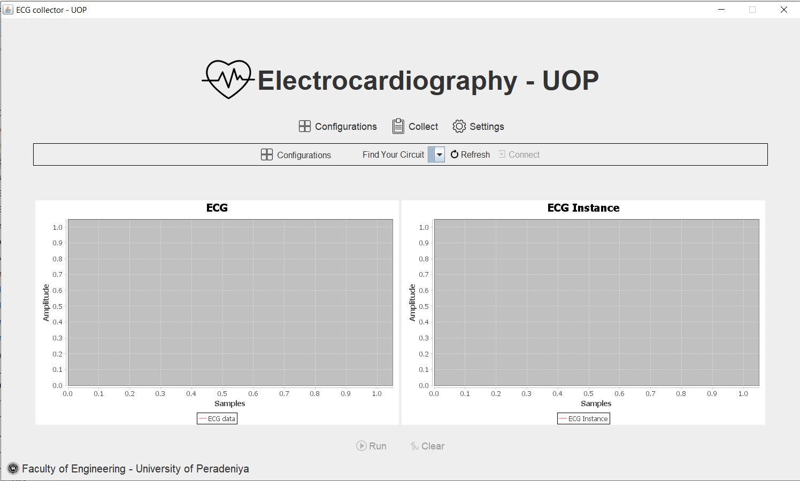

# ECG-UOP
This is a simple GUI for collect ECG data on serial stream 
It is a java application used java swing 

[Click here](https://github.com/DarshanaUOP/ECG-UOP/raw/master/out/artifacts/ECG_UOP_jar/ECG-UOP.jar) to download the jar application.

### The GUI
Followiing figure is showing the GUI of the system  
 
it shows 3 menu components, a status bar and two plotting areas (*jFreeChart used*) 

### Menu components
The application has three menu components. they are,
* Configurations 
* Collect and
* Settings

### Configurations
Under the configurations menu it can connect with the [sampler circuit](https://github.com/DarshanaUOP/TIMER_INTERRUPT_ECG_SAMPLER).
the following figure is showing the UI of the configuration menu  
 

### Collect
 

Collect menu is used to set the path to save your data into a *csv* file. by click on the *"Select a path to save file"* you can select the path to save your data into the csv file as shown in the folowing figure.  

### Settings
Under the settings section you can change the appearances of your UI, the following figure is showing the settings window  
 

***Note*** : Some components of this application has to update.
